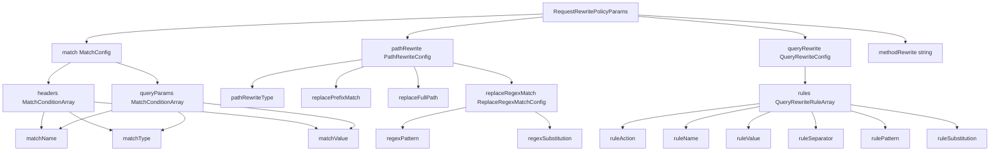

# Request Rewrite

## Overview

The Request Rewrite policy updates incoming requests before they are sent to the upstream service. It can rewrite the request path, query parameters, and HTTP method. Rewrites can also be gated with optional header and query-parameter match conditions.

At least one of `pathRewrite`, `queryRewrite`, or `methodRewrite` must be configured.

## Features

- Rewrites paths using prefix replacement, full path replacement, or regex substitution
- Rewrites query parameters using ordered rules
- Rewrites HTTP methods (`GET`, `POST`, `PUT`, `DELETE`, `PATCH`, `HEAD`, `OPTIONS`)
- Supports conditional execution based on request headers and query parameters
- Supports regex matching and substitution with capture groups (RE2 syntax)

## Configuration

The Request Rewrite policy uses a single-level configuration model where all parameters are configured per-API/route in the API definition YAML.

### User Parameters (API Definition)

These parameters are configured per API/route by the API developer:

| Parameter | Type | Required | Description |
|-----------|------|----------|-------------|
| `match` | `MatchConfig` object | No | Optional match conditions that gate whether rewrite actions are applied. |
| `pathRewrite` | `PathRewriteConfig` object | No | Path rewrite configuration. |
| `queryRewrite` | `QueryRewriteConfig` object | No | Query parameter rewrite configuration. |
| `methodRewrite` | string | No | HTTP method to rewrite to. Allowed values: `GET`, `POST`, `PUT`, `DELETE`, `PATCH`, `HEAD`, `OPTIONS`. |

> **Note**: At least one of `pathRewrite`, `queryRewrite`, or `methodRewrite` is required.


### MatchConfig Configuration

The `MatchConfig` object supports the following fields:

| Field | Type | Required | Description |
|-------|------|----------|-------------|
| `headers` | `MatchCondition` array | No | Header matchers. All entries must match for rewrite execution. |
| `queryParams` | `MatchCondition` array | No | Query parameter matchers. All entries must match for rewrite execution. |

### MatchCondition Configuration

Both header and query parameter matchers use the same structure:

| Field | Type | Required | Description |
|-------|------|----------|-------------|
| `name` | string | Yes | Header/query-parameter name. Header matching is case-insensitive. |
| `type` | string | Yes | Match type: `Exact`, `Regex`, or `Present`. |
| `value` | string | Conditional | Required for `Exact` and `Regex`; not used for `Present`. |

### PathRewriteConfig Configuration

The `PathRewriteConfig` object supports the following fields:

| Field | Type | Required | Description |
|-------|------|----------|-------------|
| `type` | string | Yes | Path rewrite type: `ReplacePrefixMatch`, `ReplaceFullPath`, or `ReplaceRegexMatch`. |
| `replacePrefixMatch` | string | Conditional | Required when `type` is `ReplacePrefixMatch`. Replaces the matched operation path prefix. |
| `replaceFullPath` | string | Conditional | Required when `type` is `ReplaceFullPath`. Replaces the full relative path. |
| `replaceRegexMatch` | `ReplaceRegexMatchConfig` object | Conditional | Required when `type` is `ReplaceRegexMatch`. Applies regex substitution on the relative path. |

`pathRewrite.type` controls how the path is transformed:

| Type | Required Fields | Description |
|------|------------------|-------------|
| `ReplacePrefixMatch` | `replacePrefixMatch` | Replaces the matched operation path prefix with `replacePrefixMatch`. |
| `ReplaceFullPath` | `replaceFullPath` | Replaces the full relative path with `replaceFullPath`. |
| `ReplaceRegexMatch` | `replaceRegexMatch.pattern`, `replaceRegexMatch.substitution` | Applies regex substitution on the relative path. |

### ReplaceRegexMatchConfig Configuration

The `ReplaceRegexMatchConfig` object supports:

| Field | Type | Required | Description |
|-------|------|----------|-------------|
| `pattern` | string | Yes | Regex pattern (RE2 syntax). |
| `substitution` | string | Yes | Replacement string. Capture groups can be referenced using `\1`, `\2`, etc. |

### QueryRewriteConfig Configuration

The `QueryRewriteConfig` object supports:

| Field | Type | Required | Description |
|-------|------|----------|-------------|
| `rules` | `QueryRewriteRule` array | Yes | Ordered list of query rewrite rules. Rules are applied sequentially. |

`queryRewrite.rules` are applied in order.

### QueryRewriteRule Configuration

| Field | Type | Required | Description |
|-------|------|----------|-------------|
| `action` | string | Yes | `Replace`, `Remove`, `Add`, `Append`, or `ReplaceRegexMatch`. |
| `name` | string | Yes | Target query parameter name. |
| `value` | string | Conditional | Used by `Replace`, `Add`, and `Append`. |
| `separator` | string | No | Used by `Append`; defaults to empty string when omitted. |
| `pattern` | string | Conditional | Used by `ReplaceRegexMatch`. |
| `substitution` | string | Conditional | Used by `ReplaceRegexMatch`. Supports capture groups (`\1`, `\2`, etc.). |

**Note:**

Inside the `gateway/build.yaml`, ensure the policy module is added under `policies:`:

```yaml
- name: request-rewrite
  gomodule: github.com/wso2/gateway-controllers/policies/request-rewrite@v0
```

## Reference Scenarios

### Example 1: Prefix Path Rewrite

Replace an operation path prefix while preserving the remaining path:

```yaml
apiVersion: gateway.api-platform.wso2.com/v1alpha1
kind: RestApi
metadata:
  name: catalog-api-v1.0
spec:
  displayName: Catalog API
  version: v1.0
  context: /catalog/$version
  upstream:
    main:
      url: http://sample-backend:5000
  operations:
    - method: GET
      path: /products/*
      policies:
        - name: request-rewrite
          version: v0
          params:
            pathRewrite:
              type: ReplacePrefixMatch
              replacePrefixMatch: /items
```

### Example 2: Query Rewrite with Ordered Rules

Normalize and enrich query parameters before forwarding:

```yaml
apiVersion: gateway.api-platform.wso2.com/v1alpha1
kind: RestApi
metadata:
  name: search-api-v1.0
spec:
  displayName: Search API
  version: v1.0
  context: /search/$version
  upstream:
    main:
      url: http://sample-backend:5000
  policies:
    - name: request-rewrite
      version: v0
      params:
        queryRewrite:
          rules:
            - action: Replace
              name: q
              value: "latest news"
            - action: Append
              name: tags
              separator: ","
              value: "gateway"
            - action: Remove
              name: debug
  operations:
    - method: GET
      path: /documents
```

### Example 3: Conditional Rewrite + Method Rewrite

Apply rewrites only when match conditions are satisfied:

```yaml
apiVersion: gateway.api-platform.wso2.com/v1alpha1
kind: RestApi
metadata:
  name: orders-api-v1.0
spec:
  displayName: Orders API
  version: v1.0
  context: /orders/$version
  upstream:
    main:
      url: http://sample-backend:5000
  operations:
    - method: POST
      path: /submit
      policies:
        - name: request-rewrite
          version: v0
          params:
            match:
              headers:
                - name: X-Client-Type
                  type: Exact
                  value: mobile
              queryParams:
                - name: preview
                  type: Present
            pathRewrite:
              type: ReplaceFullPath
              replaceFullPath: /v2/orders/preview
            methodRewrite: GET
```

## How it Works

**Configuration Object Flow**



- The policy evaluates optional `match` conditions first; rewrites are applied only when all configured header and query matchers succeed.
- Path rewrite, query rewrite, and method rewrite are then applied in request phase using the configured objects; at least one rewrite object must be present.
- Path rewriting operates on the path relative to API context, and query rewrite rules are executed sequentially in the order provided.
- Regex-based path and query substitutions use RE2 syntax and support capture-group substitutions in replacement strings.
- Invalid rewrite configuration at runtime results in an immediate `500` configuration error response.


## Notes

- Path rewrites are applied to the path relative to API context, then API context is preserved in the final forwarded path.
- For `ReplacePrefixMatch`, the matched prefix is derived from the operation path where the policy is attached.
- Query rewrite rules run sequentially; later rules see the results of earlier rules.
